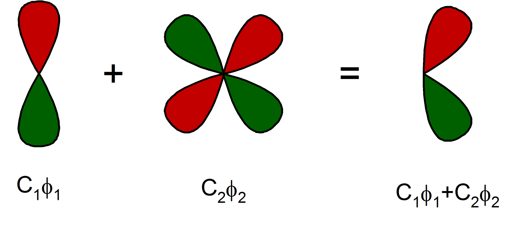

# Porphyrins

Porphyrins are complexes based on a porphine molecule bound to a metal ion in the center. They are found in various biological systems. For example, heme is a porphyrin, which is a part of the hemoglobin complex that binds oxygen in your blood. Chlorophyll, which is responsible for photosynthesis, also has a porphyrin group. 


*Porphine* ([source](https://en.wikipedia.org/wiki/Porphyrin#/media/File:Porphyrin.svg))


*Heme binding oxygen* ([source](https://en.wikipedia.org/wiki/Heme#/media/File:Mboxygenation.png))

In the electrochemistry project you will do or have done, porphyrins are deposited on a metal surface. Their metal centers can catalyze the oxygen reduction reaction. In this project, we will use density functional theory calculations to try and understand the reaction mechanism.

## Density functional theory for molecules

Remember that our goal is to find the ground-state energy of several systems, from which we can then calculate the binding energy. (In experimental conditions, molecules are close to the ground state as well.)

To this end we want to solve the Kohn-Sham equations for the orbitals (one-electron wave functions) $\psi_i$ and their energies $\varepsilon_i$. Wave functions are functions, which you could view as an infinite collection of numbers: there are infinitely many points in space, and each space has a corresponding value of the wavefunction. How do we put this into a computer?

One option would be to divide space into a grid (like a 3D chess board) and solve the wave function in each cube. It turns out that this is not very efficient. Instead, it turns out that wave functions usually have pretty similar shapes. In practice we 'build' each orbital out of a small collection of basic functions $\phi_i$:

$$ \psi(x) = c_1 \phi_1(x) + c_2 \phi_2 (x) + \cdots .$$

The $\phi_i$ are called *basis functions*, and $c_i$ are the *coefficients* that scale them. The collection of all $\phi_i$ is called a *basis set*. The image below shows an example.



*Combining basis functions into an orbital.* ([source](https://en.wikipedia.org/wiki/Basis_set_(chemistry)#/media/File:D-polarization_function.png))

Now the computer just needs to calculate the coefficients $c_i$. For the radial part, one popular basis function is an exponential function

$$e^{-\zeta r}. $$

Different basis functions are have different values of $\zeta$. The symbol $\zeta$ is called a zeta, so a collection of three basis functions is often called a triple-zeta basis set (TZ), for example. The more basis functions you choose, the closer you can get to the ground state energy. However, the calculation might take longer. You can read more about basis sets [here](https://chem.libretexts.org/Courses/Pacific_Union_College/Quantum_Chemistry/11%3A_Computational_Quantum_Chemistry/11.02%3A_Gaussian_Basis_Sets) (not required).

In the following, we will use the Amsterdam Modelling Suite (AMS) software to calculate the binding energy of oxygen to porphyrin molecules. The software is available here: https://www.scm.com/support/downloads/. Ask your supervisor for instructions to install with the university license.

First, let's get used to the software.

## Task 1: geometry optimization of ethanol

Follow [the tutorial on the website of AMS SCM](https://www.scm.com/doc/Tutorials/GettingStarted/GeometryOptimizationOfEthanol.html). Pay attention to the following things.

* In the `.logfile`: look for the word SCF, which stands for 'self consistent field'. You can see that the software is running multiple cycles of the self-consistent procedure.
* Notice that the energy is minimized until it does not change much anymore. The change in energy before and after solving the Kohn-Sham equations is denoted as absolute error (`|Error|`).
* Practice saving images, which you will need later for writing your report (you don't need to write about the ethanol tutorial, though). 

Now we are ready to do our first 'useful' calculation.

## Task 2: simulate an oxygen molecule

* In a new AMS input file, build an oxygen molecule. Pre-optimize the geometry with a simplified calculation method (force fields) using the button: 
    
    

* The ground state of oxygen has two unpaired electrons. Using the internet or your own knowledge, find out how many electrons are unpaired. The number of unpaired electrons should be entered into the field 'Spin polarization'. To enter something in this field, you need to check the 'Unrestricted' box.

* In the rest of the practical we will use the XC functional BP86 (find it under the GGA group) and a TZ2P basis set. Choose the same settings here for consistency. (Convince yourself that this is important.)

* Write down the energy you get. How to find the energy? [Have a look at this page](https://www.scm.com/doc/Tutorials/GettingStarted/10WaysToGetTheEnergy.html) 
<!-- My result: -9.85632954095 eV; Gibbs -10.2771 eV -->

* Change the task from 'Single Point' to 'Geometry Optimization' and check the 'Frequencies' box so that we optimize the geometry and obtain information about the vibrations of an oxygen molecule. 

* The vibrational frequency is in the `.out` file. Compare it to a value you find from a (reliable) source on the internet.

* Save the thermodynamic information (Statistical Thermal Analysis at the end of the `.out` file.).

<!-- ```{admonition} Bonus task 
:class: tip, dropdown

Compare with the results of a different XC functional, for example the more advanced r2SCAN-D4. How reliable are our results? What about different basis sets?
``` -->

## Task 3: simulate a metalloporphyrin

First, write down which metal ion is in the porphyrin you have researched or will research in the lab part of LO1. This should be iron for Team 3, cobalt for Team 5, and any of iron, cobalt and manganese for Team 4. If we don't have much time, choose iron.

* In a new AMS input file, create a porphyrin molecule using the following shortcut:

    

* Remove the two 'attachment' sticks on the side of the iron center.

* Replace the metal center with the relevant metal atom, and pre-optimize the geometry.


The electronic configuration of the metals is something like $\mathrm{[Ar]} 3d^n 4s^2$, where $n$ depends on the metal. The metal center usually has oxidation state +2, so Fe(II) {cite:p}`radon2008binding`, Mn(II) {cite:p}`phung2018dioxygen`, or Co(II) {cite:p}`zhang2020controlling, lv2021controlling`. The two electrons are removed from $4s$. The $3d$ orbitals (which can hold max. 10 electrons) are partially filled. 

* Write down the different possible spin configurations. What is the number of unpaired electrons for each of them? 

* Using the following articles, find what the ground state of your porphyrin is. Enter the number of unpaired electrons in the field 'Spin polarization' (check 'Unrestricted' as 'Yes').
    * FeP: {cite:t}`matsuzawa1995density, rovira1998oxygen` 
    * MnP: {cite:t}`phung2018dioxygen`
    * CoP: {cite:t}`de2020can` (this one's difficult, don't hesitate to ask for help).

We use the GGA XC functional BP86 as recommended by {cite:t}`ovalle2022choice` with a TZ2P basis set (should be more or less similar to their basis set A). Use a 'large' frozen core and a 'scalar' relativity correction.

* Calculate and note down the energy. <!-- My result: -261.05943748 eV with geometry optimization -->


## Task 4: simulate a metalloporphyrin binding an oxygen molecule
Oxygen can bind to the metal center. In this bond, the valence orbitals of oxygen and the metal interact. When looking at the spin state of oxygen before, you found that some electrons are unpaired. 

* Using Fig. 3 in {cite:t}`phung2018dioxygen`, construct molecular orbital diagrams (there may be multiple possibilities) for a metalloporphyrin bonded to $\mathrm{O_2}$. 

Based on {cite:t}`phung2018dioxygen, rovira1998oxygen` we'll assume that the ground-state of the oxygen-bound complex usually has the lowest possible spin.

* How many unpaired electrons are there in the final molecule?

* Create a new AMS input file. Add a porphyrin and add an $\mathrm{O_2}$ molecule that binds with one atom to the metal center. Pre-optimize the geometry.

* Compare your pre-optimized geometry to figures in {cite:t}`rovira1998oxygen`. What can you conclude about the accuracy of the energy calculation, if we only pre-optimize the structure like we have now?

* Calculate the energy with the same settings as in the previous exercise. Note down the energy. <!-- My result: -272.21482872 eV with geom. opt. -->

* If you go to SCM -> Levels, right-click on one of the molecular orbitals and select the first option, you can visualize the orbitals. Visualize the HOMO and compare to Fig. 3 in {cite:t}`phung2018dioxygen`.

* We don't have time to do frequency calculations. Note down BP86 thermal corrections from literature. Tip: [convert everything to the same unit, like eV](https://www.colby.edu/chemistry/PChem/Hartree.html) 
    * FeP: look at {cite:t}`phung2018dioxygen` <!--  0.008673 eV for FePO2 is negligible -->
    * MnP: also look at {cite:t}`phung2018dioxygen`
    * CoP: I couldn't find any thermal correction/ZPE data... Try look for it, or assume the same as for FeP/MnP


## Task 5: binding energy

Now we have all the necessary ingredients to calculate the binding energy.

* Calculate the Gibbs binding energy. Compare to Table 2 in {cite:t}`phung2018dioxygen` and Table 6 in {cite:t}`radon2008binding` (five-coordinated complexes). <!-- I get delta G ~ -0.84 eV, which is about 19.46 kcal/mol, not too far off from their BP86 results, probably different basis set also plays a role, and we didn't correct for spin stuff, which gives another correction of ~7 kcal/mol -->

* Why could there be differences? Try to find out using {cite:p}`phung2018dioxygen`, for example. Note: DMRG-CASPT2 is a very accurate wave function method, that does not suffer from many of the approximations made in DFT. Also think about the spin states we assumed, and our geometry optimization.

## Task 6: small research project

Choose an interesting research project, and do your own calculations. Compare the results to literature if you can. Here's some ideas:

* Vary the metal center of the porphyrin (suggested for Team 4). 
    * Compare the binding energies. Correlate them with the experimental data you will collect or have collected in the lab.
    * I haven't been able to find the setting for calculating the vib. freq. of a specific bond. But if we find it, it would be interesting to calculate the vibrational frequency of the metal-oxygen bond for various metal centers. 


* Add a solvation model, COSMO, to study the effect of a solvent (suggested for Team 5).

* Team 5 can also look at the effect of pH by calculating the binding energy with an $\mathrm{OH^-}$ molecule on the opposite side of the metal center as where the oxygen binds. See https://doi.org/10.1016/j.cattod.2017.05.007 and https://pubs.acs.org/doi/10.1021/jacs.3c11246. However, make sure to have enough time.

* Study the effect of geometry optimization on the binding energy. You can try if choosing the LDA XC functional {cite:p}`rovira1998oxygen` speeds up geometry optimization. Tip: you can make very cool movies if you go to the SCM (top left) -> Movies menu.

* Choose a different functional suggested by literature, such as TPSSh {cite:p}`ovalle2022choice` or LDA {cite:p}`rovira1998oxygen`, and compare the binding energy.

If you're curious about something else, feel free to research that instead.


## References

```{bibliography}
:style: unsrt
```